# Podręcznik użytkownika

Aplikacja po uruchomieniu otwiera główne okno pokazane na poniższym obrazie. Są na nim umieszczone przyciski umożliwiające korzystanie z funkcjonalności oferowanych przez program.

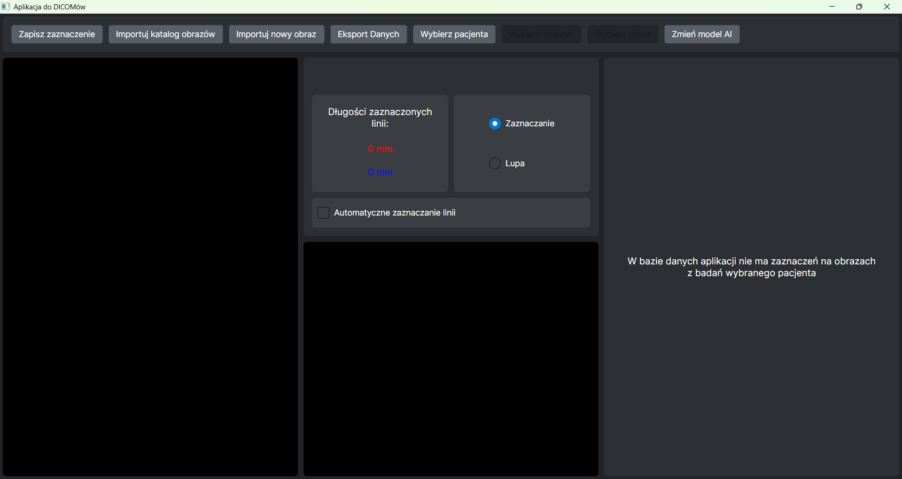

## Import obrazu DICOM z pliku

Aplikacja umożliwia import obrazu DICOM. Po kliknięciu przycisku `Importuj nowy obraz` pojawia się okno eksploratora plików. Po wybraniu w tym oknie pliku DICOM zostaje on zaimportowany do aplikacji a następnie wyświetlony. Poniższe zdjęcie przedstawia przykładowy widok po imporcie obrazu. Po lewej stronie otwiera się zaimportowany obraz, a w środkowej części na górze są wyświetlane imię i nazwisko pacjenta oraz data badania.

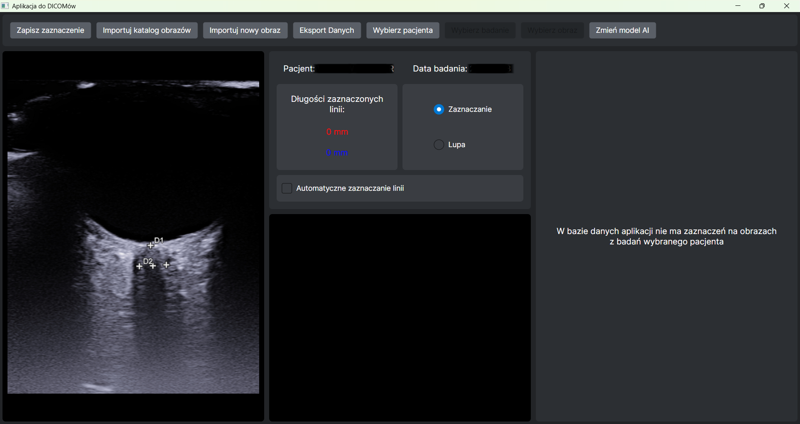

Wyświetlany obraz DICOM jest przycięty tak, by obrazowanie USG było w pełni widoczne, ale aby nie były wyświetlane metadane wypalone na obrazie. Przykład oryginalnego i przyciętego obrazu jest na rysunkach poniżej.

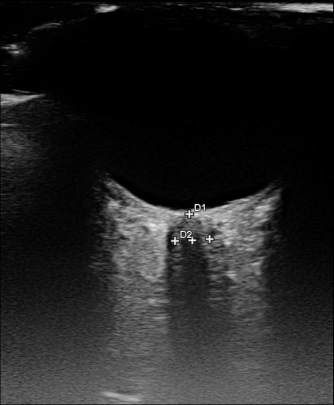
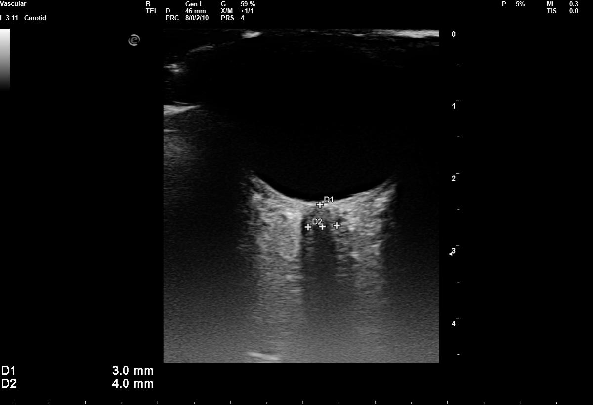

## Import katalogu obrazów DICOM

Program umożliwia zaimportowanie wybranego katalogu obrazów DICOM. W tym celu należy kliknąć przycisk `Importuj katalog obrazów`. Po kliknięciu przycisku zostaje otwarte okno eksploratora plików. Należy wybrać tam odpowiedni katalog, a aplikacja zaimportuje z niego wszystkie pliki DICOM. Na zakończenie importu plików do aplikacji pojawia się o tym informacja taka jak na zdjęciu poniżej.

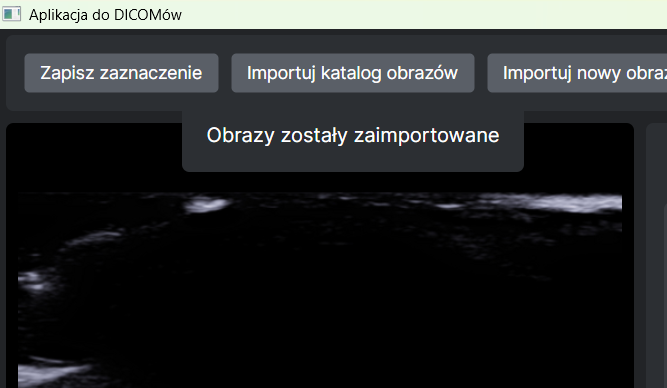

## Otwieranie zaimportowanego obrazu

Jeśli w aplikacji są zaimportowane obrazy (z użyciem `Importuj nowy obraz` lub `Importuj katalog obrazów`) można je otwierać wybierając je na podstawie pacjenta i daty badania. Kliknięcie na przycisk `Wybierz pacjenta` otwiera listę pacjentów, których obrazy zostały zaimportowane do aplikacji, zgodnie z rysunkiem:

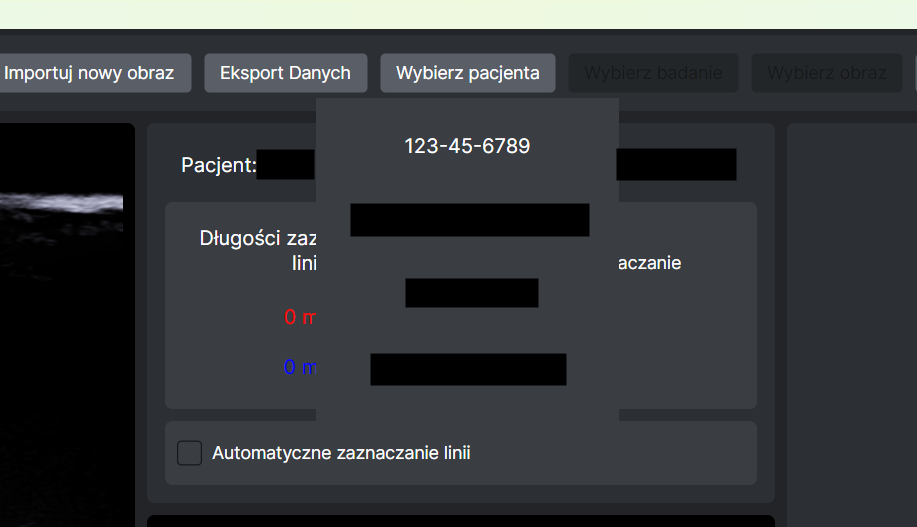

Po wybraniu pacjenta z listy (poprzez kliknięcie na jedną z możliwości) zostaje odblokowany przycisk `Wybierz badanie`. Naciśnięcie go otwiera listę dat badań wybranego pacjenta, które zostały zaimportowane. W podobny sposób można wybrać badanie, z którego obraz ma zostać otworzony. Daty badania do wyboru są zapisane w formacie `yyyy.mm.dd`. Na rysunku został przedstawiony przykładowy widok w trakcie wyboru badania:

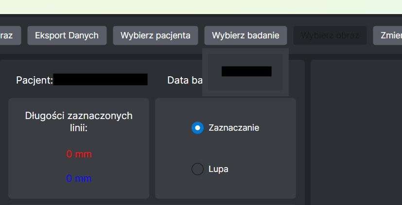

Gdy zostanie wybrane badanie przycisk `Wybierz obraz` zostaje odblokowany. W momencie kliknięcia tego przycisku otwiera się lista obrazów z wybranego badania danego pacjenta. Po wybraniu obrazu zostaje on wyświetlony. Wtedy ekran aplikacji przypomina:

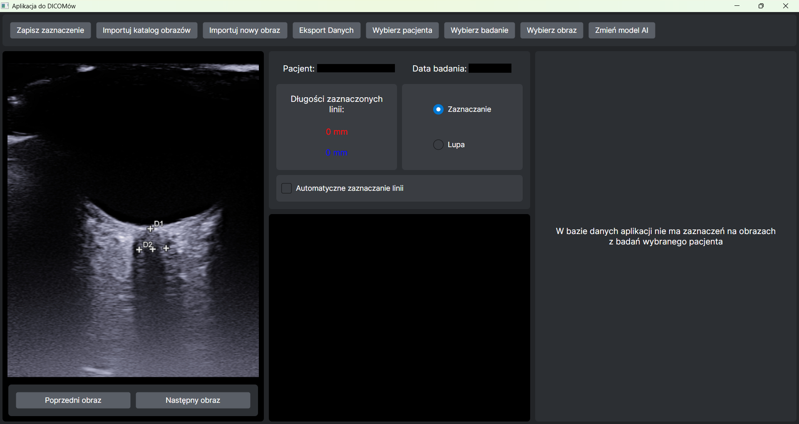

Zgodnie z tym, co widać na powyższym rysunku, w momencie otwarcia obrazu w ten sposób pojawiają się pod nim przyciski `Poprzedni obraz` oraz `Następny obraz`. Umożliwiają one łatwe przechodzenie między obrazami z tego samego badania. 

Przyciski `Wybierz pacjenta`, `Wybierz badanie`, `Wybierz obraz` umożliwiają zmienianie wybranych wartości. Jeśli zmieni się wybranego pacjenta, to przycisk `Wybierz obraz`  zostanie zablokowany do czasu wybrania badania.

## Rysowanie linii na obrazie

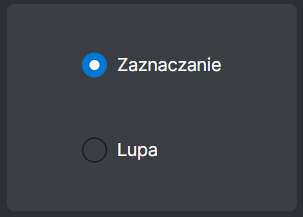

Jeśli zaznaczona jest opcja `Zaznaczanie` (zgodnie z rysunkiem powyżej), umożliwione jest zaznaczanie linii na obrazie. Można je zaznaczać naciskając lewy przycisk myszy w punkcie na obrazie, który powinien zostać początkiem linii, a puszczając go w punkcie końcowym. Są dostępne dwie linie - czerwona i niebieska, które są rysowane naprzemiennie. 

Podczas rysowania linii w czasie rzeczywistym są aktualizowane ich długości. Można je zobaczyć w środkowej części ekranu. Przykładowe zaznaczanie linii:

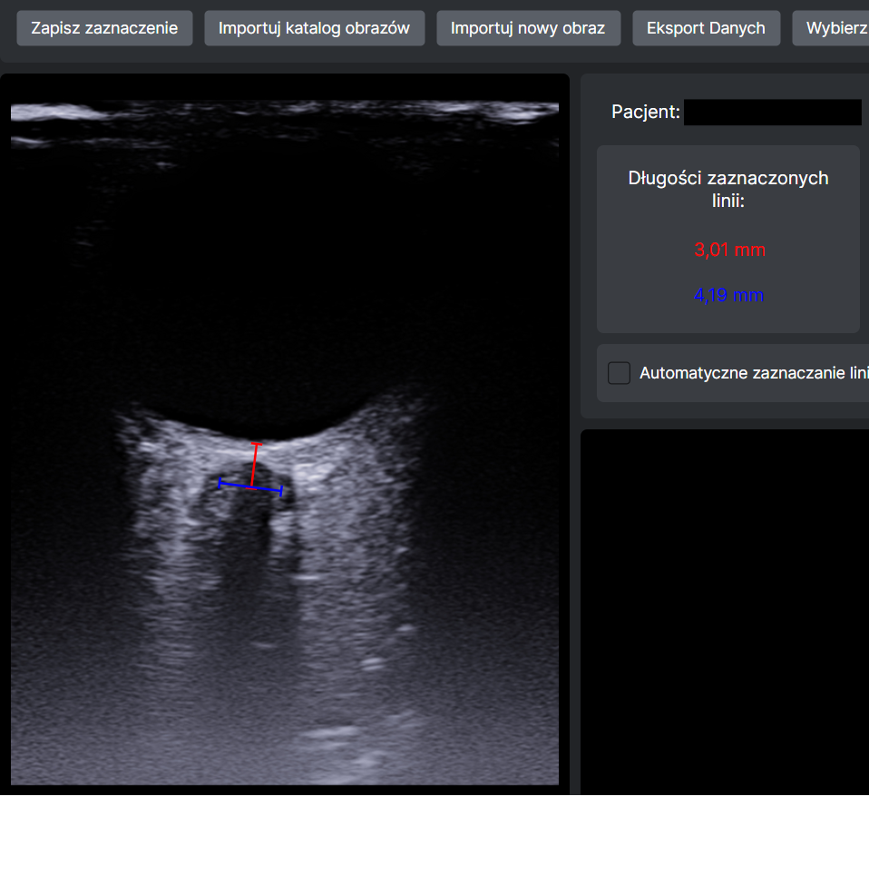

## Powiększenie obrazu

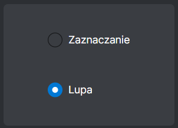

Aplikacja umożliwia powiększanie wybranego fragmentu obrazu. W tym celu należy przełączyć na tryb `Lupa` zgodnie z rysunkiem powyżej. Po przełączeniu trybu na głównym obrazie, można wybrać fragment, który powinien zostać powiększony. W momencie przytrzymania lewego przycisku myszy w wybranym punkcie na obrazie, zostaje ustawiony fragment pokazywany na powiększeniu. Punkt, w którym znajduje się mysz na głównym obrazie, znajduje się na środku powiększonego fragmentu. Przesuwanie (przy naciśnięciu) myszy po ekranie głównego obrazu pozwala na przesuwanie powiększanego fragmentu. 

Po wybraniu odpowiedniego fragmentu, który jest powiększony, można zaznaczać na nim linie. Dzięki temu można zaznaczać je z większą dokładnością. Długości zaznaczanych linii są wyświetlane w tym samym miejscu co w przypadku zaznaczana linii na obrazie głównym. Linie są też odwzorowywane w czasie rzeczywistym na główny obraz:

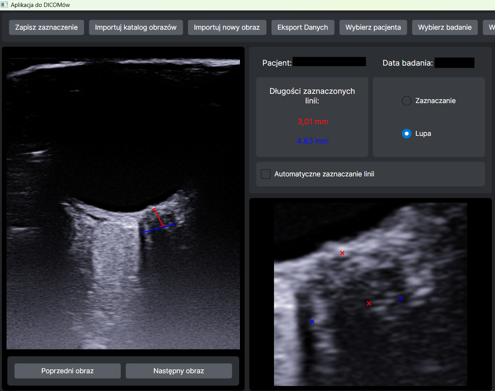

## Zapisywanie zaznaczonych linii

Po zaznaczeniu linii na obrazie (głównym bądź na powiększeniu) można zapisać to zaznaczenie do bazy danych przyciskiem `Zapisz zaznaczenie`.

## Eksport zapisanych danych

Przycisk `Eksport Danych` uruchamia eksport danych zapisanych w aplikacji. Zostaje utworzony katalog na Pulpicie zawierający zapisane pliki PNG obrazów oraz pliki CSV z informacjami wyeksportowanymi z bazy danych. Dane wyeksportowane przez aplikację są w pełni anonimowe. .ZIP wyeksportowanego katalogu zostaje też zapisany na Pulpicie.

## Wykres przebiegu zmian w czasie szerokości nerwu wzrokowego

W momencie otwierania obrazu w aplikacji może zostać wyświetlony wykres. Jeśli w bazie danych aplikacji jest zapisane co najmniej jedno zaznaczenie na obrazie pacjenta, którego zdjęcie USG jest otwierane, zostaje wyświetlony wykres. Na wykresie znajdują się wyznaczone szerokości nerwu wzrokowego oka. Na osi X wykresu są daty badań, z których te wartości pochodzą. Umożliwia to przegląd zmian szerokości nerwu wzrokowego oka u danego pacjenta. Przykładowy wykres:

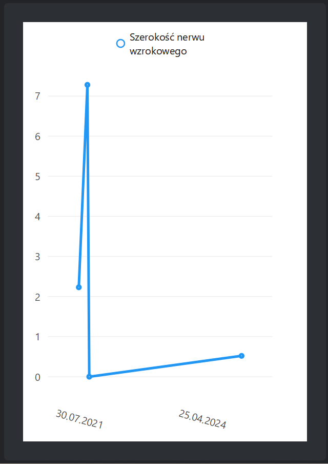

Wykres zostaje wyświetlony w prawej części okna aplikacji. Jeśli w bazie danych nie ma zapisanych zaznaczeń umożliwiających stworzenie wykresu, zostaje w jego miejsce wyświetlony komunikat `W bazie danych aplikacji nie ma zaznaczeń na obrazach z badań wybranego pacjenta`.

## Wykorzystanie Sztucznej Inteligencji w aplikacji

Aplikacja umożliwia wykorzystanie modelu Sztucznej Inteligencji do predykcji punktów, na podstawie których jest wyznaczana szerokość nerwu wzrokowego oka. Aby włączyć korzystanie ze sztucznej inteligencji należy zaznaczyć `Automatyczne zaznaczanie linii`:

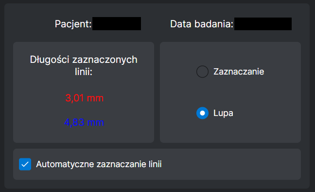

Od tego momentu w chwili otwierania obrazów będzie na nich automatycznie zaznaczana predykcja modelu sztucznej inteligencji. Będzie ona zaznaczana z pomocą linii rysowanych na obrazie. 

Program umożliwia wgranie własnego modelu AI. Przycisk `Zmień model AI` otwiera eksplorator plików i pozwala na wybranie pliku formatu `.ONNX`, który zostanie zaimportowany do aplikacji. Jeśli wgrany model będzie spełniał [wymagania techniczne](README.MLIO_pl.md), będzie on od momentu wgrania używany w aplikacji do predykcji punktów. Model można wgrywać wielokrotnie, co umożliwia korzystanie z różnych modeli.